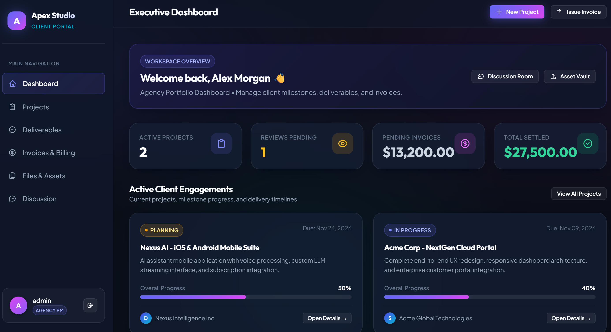

# Client Portal & Project Management System

A production-grade, full-stack web application designed for modern digital agencies, consulting firms, and freelancers to streamline client collaboration, project milestone tracking, deliverable reviews, financial billing, shared document repositories, and real-time project messaging.

Built with **Spring Boot 3.3.4**, **Spring Security 6**, **Hibernate / Spring Data JPA**, **MySQL & H2**, and **Thymeleaf**, the platform features a responsive glassmorphic dark-mode interface with zero external CSS frameworks.

---

## 🌟 Overview & Key Highlights

The **Client Portal & Project Management System** bridges the communication gap between agencies and enterprise clients. It replaces fragmented email threads, scattered spreadsheet trackers, and third-party file links with a unified, role-governed client portal.

- **Dual Personas & Multi-Tenant Scoping**: Agency Leads (`ROLE_ADMIN`) oversee all operations, while Clients (`ROLE_CLIENT`) have access restricted strictly to their assigned organization's projects, milestones, invoices, and documents.
- **Interactive Review Cycles**: Clients review staging releases and Figma prototypes directly within the portal, formally submitting **Approved** or **Changes Requested** decisions with detailed feedback notes.
- **Dynamic Milestone Roadmaps**: Real-time progress percentage recalculations and toggleable completion checklists.
- **Comprehensive Financial Center**: Multi-status invoice management (`PAID`, `SENT`, `OVERDUE`) with tax/VAT computation, printable statements, and simulated payment gateways.
- **Secure Document Vault**: Categorized asset repository with drag-and-drop file upload and authenticated download access.
- **Threaded Discussion Room**: Project-specific messaging with author attribution and real-time polling REST API endpoints.

---

## 📸 Screenshots

### Executive Dashboard

*High-contrast executive dashboard displaying active engagements, approval queues, financial metrics, and recent activity feed.*

---

### Core Module Views

| Module | Interface Preview & Description |
| :--- | :--- |
| **Projects & Engagements** | Comprehensive engagement portfolio with completion status, budget utilization, manager assignment, and date ranges. |
| **Project Details & Milestones** | Multi-tab command center featuring interactive milestone roadmaps, live progress meters, and phase checklists. |
| **Deliverables & Client Review** | Version-tracked assets (`v1.0`, `v0.8-beta`) with direct preview links and official approval/change request modals. |
| **Invoices & Billing** | Financial health overview with invoice generation, payment method logs (Stripe, ACH, Wire), and printable tax invoices. |
| **Files & Asset Vault** | Filterable document repository by category (`Contract`, `Design Spec`, `Deliverable`, `Brand Guide`) with instant download. |
| **Discussion & Messaging** | Dedicated chat room per project featuring threaded conversation bubbles and live REST polling. |

---

## 👥 User Roles & Authentication

The application enforces fine-grained **Role-Based Access Control (RBAC)** via Spring Security 6:

### 1. Agency Administrator / Project Manager (`ROLE_ADMIN`)
- Create, update, and manage all client projects and budgets.
- Define project milestones and assign target completion dates.
- Submit deliverables for client review with external staging/prototype links.
- Generate and manage invoice records, log payments, and track revenue.
- Upload project agreements, SOWs, and architectural specifications.
- Post official agency updates in project discussion channels.

### 2. Client Contact (`ROLE_CLIENT`)
- Access scoped strictly to the client's registered organization.
- View real-time milestone progress and project health.
- Formally review deliverables: **Approve** or **Request Changes** with structured feedback.
- View and download invoices and print formatted payment statements.
- Upload project briefs, feedback documents, and brand assets to the vault.
- Chat directly with the assigned agency project team in the discussion channel.
- Access to administrative routes (e.g. `/projects/new`) is strictly blocked (**HTTP 403 Forbidden**).

### Pre-Seeded Demo Credentials

| Role | Username | Password | User Name & Organization |
| :--- | :--- | :--- | :--- |
| **Agency Lead / PM** | `admin` | `admin123` | Alex Morgan &bull; Apex Studio Agency |
| **Client (Acme Corp)** | `acme_client` | `client123` | Sarah Connor &bull; Acme Global Technologies |
| **Client (Nexus AI)** | `nexus_client` | `client123` | David Zhang &bull; Nexus Intelligence Inc |

> **Note**: The login screen includes **1-click quick-fill buttons** to effortlessly switch between Admin and Client accounts during evaluation. Self-registration is also available via `/register`.

---

## 🛠️ Technologies Used

### Backend
- **Java 21** (LTS)
- **Spring Boot 3.3.4**
- **Spring Security 6** (BCrypt hashing, session authentication, CSRF tokens, method security)
- **Spring Data JPA & Hibernate 6** (Optimized `JOIN FETCH` queries, transactional services)
- **Bean Validation (Hibernate Validator / Jakarta Validation)**
- **HikariCP** (High-performance connection pooling)

### Database
- **H2 In-Memory Database** (Active by default in `MODE=MySQL` for zero-configuration local execution)
- **MySQL 8.0** (Production profile configured in `application-mysql.properties`)

### Frontend
- **Thymeleaf 3** (Server-side templating with Spring Security dialect integration)
- **Vanilla CSS (Design System)** (`portal.css` — Custom glassmorphism, responsive sidebar, CSS variables, dark theme)
- **Vanilla JavaScript** (`portal.js` — Client-side modal management, tabs, form validation, and asynchronous REST fetch)
- **Google Fonts** (Plus Jakarta Sans & Outfit)

---

## 📦 Main Application Modules

### 1. Dashboard (`/dashboard`)
Role-tailored overview displaying key performance metrics: active projects count, deliverables awaiting review, outstanding financial balances, and a chronological audit log of recent updates across all modules.

### 2. Projects (`/projects`)
Multi-tenant project portfolio. Displays engagement cards with calculated progress percentages, health badges, target deadlines, assigned agency lead, and client company attribution. Admins can create new engagements via `/projects/new`.

### 3. Milestones & Roadmap (`/projects/{id}?tab=milestones`)
Phased project roadmaps with target dates and interactive completion toggles. Updating milestone status recalculates overall project completion in real time.

### 4. Deliverables (`/deliverables` or `/projects/{id}?tab=deliverables`)
Version-controlled asset submissions. Allows clients to inspect deliverables and trigger the interactive review modal to approve or request changes with contextual feedback.

### 5. Invoices & Billing (`/invoices`)
Financial billing management system with invoice tracking (`DRAFT`, `SENT`, `PAID`, `OVERDUE`). Features a print-ready invoice statement view (`/invoices/{id}`) with tax calculations and payment simulator modal.

### 6. Files & Assets Vault (`/files` or `/projects/{id}?tab=files`)
Categorized document repository supporting multi-part uploads (contracts, specifications, brand assets) and authenticated streaming downloads. Includes automatic fallback generator for sample demonstration assets.

### 7. Discussion (`/messages` or `/projects/{id}?tab=messages`)
Centralized communication feed for each client project. Client and agency team members can exchange updates, notes, and questions with timestamps and author badges. Includes background REST API polling at `/api/projects/{id}/messages`.

---

## 🚀 How to Run the Project Locally

### Prerequisites
- **Java Development Kit (JDK) 21** or later:
  ```bash
  java -version
  ```
- **Apache Maven 3.9+**:
  ```bash
  mvn -version
  ```

### Quick Start (Default H2 Database)

1. Clone or navigate into the repository:
   ```bash
   cd client-portal
   ```

2. Run the application with Maven:
   ```bash
   mvn spring-boot:run
   ```

3. Open your web browser and navigate to:
   ```
   http://localhost:8080
   ```

4. Log in using any of the demo accounts listed above (or use the one-click quick-fill buttons).

---

### Running with MySQL 8.0

To run against your local MySQL service:

1. Create the MySQL database:
   ```sql
   CREATE DATABASE client_portal CHARACTER SET utf8mb4 COLLATE utf8mb4_unicode_ci;
   ```

2. Start the application using the `mysql` Spring profile:
   ```bash
   mvn spring-boot:run -Dspring-boot.run.profiles=mysql -Dspring-boot.run.arguments="--spring.datasource.username=root --spring.datasource.password=YOUR_PASSWORD"
   ```

3. Alternatively, export environment variables:
   ```bash
   export SPRING_DATASOURCE_USERNAME=root
   export SPRING_DATASOURCE_PASSWORD=YOUR_PASSWORD
   mvn spring-boot:run -Dspring-boot.run.profiles=mysql
   ```

---

## 🧪 Testing & Verification

Execute the complete automated test suite (including Spring Security authentication, RBAC authorization, and MockMvc controller tests):

```bash
mvn test
```

Build the production executable JAR:

```bash
mvn clean package -DskipTests
java -jar target/client-portal-1.0.0-SNAPSHOT.jar
```

---

## 🔗 GitHub Repository

- **Repository**: [https://github.com/Prasad0709-ai/client-portal](https://github.com/Prasad0709-ai/client-portal)
- **Branch**: `main`

---

## 🔮 Future Improvements

- **Real-Time WebSockets (STOMP)**: Replace REST polling with bidirectional WebSockets for instant message delivery and live typing indicators.
- **Stripe & PayPal Live Integration**: Connect the invoice billing simulator with live Stripe Checkout webhooks for real-time card and bank settlement.
- **Cloud Storage (AWS S3 / GCS)**: Support cloud object storage for enterprise-scale document hosting with signed URLs.
- **Email & Slack Notifications**: Automated email notifications (SendGrid / JavaMail) on deliverable review status changes and invoice payment receipts.
- **Audit Logging & Export**: Downloadable project summary reports in PDF and CSV format.
